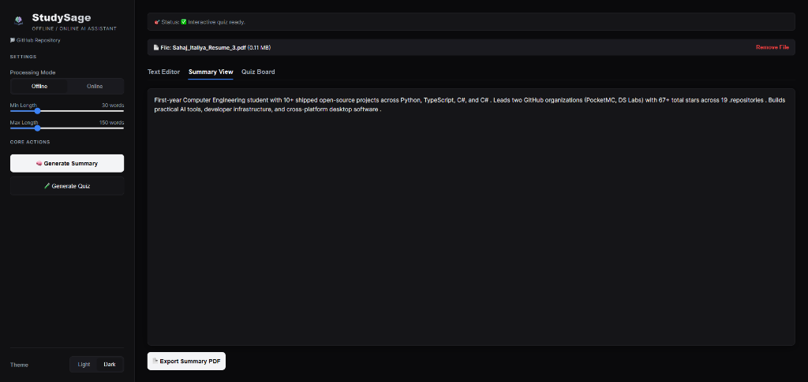
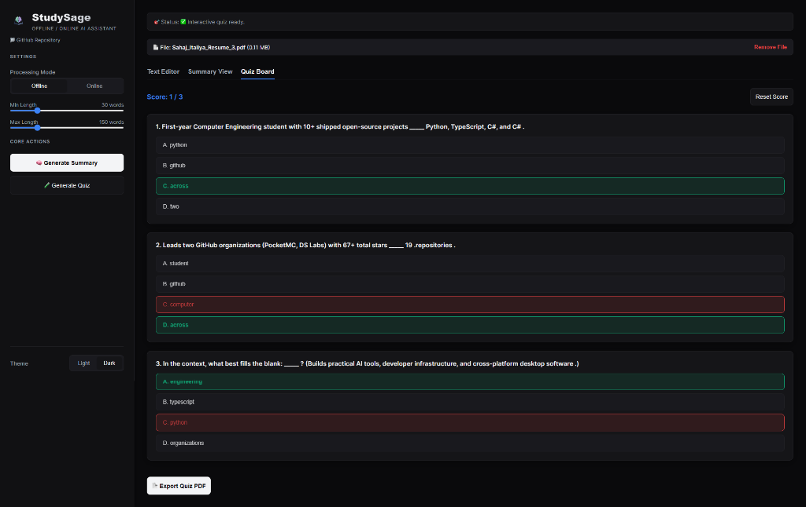
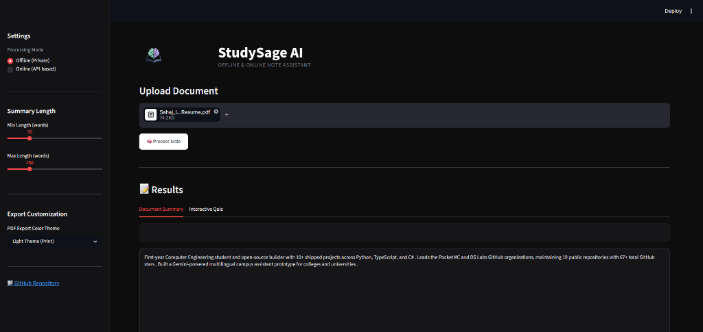
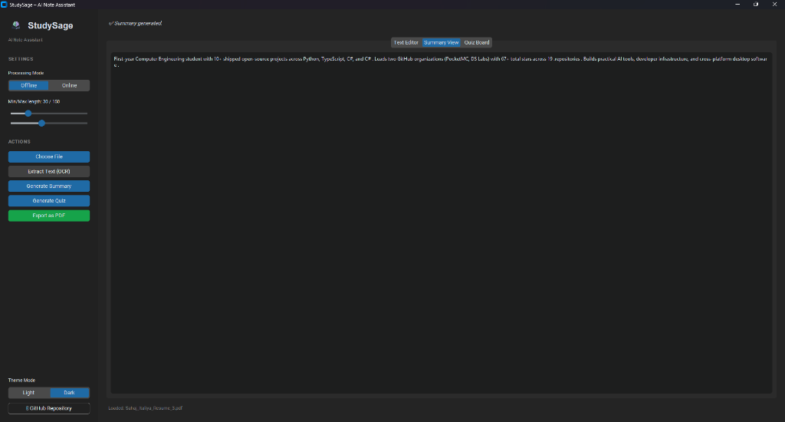

# <p align="center"><br>StudySage</p>

<p align="center">
  <strong>Offline & Online AI Note Assistant</strong>
</p>

<p align="center">
  <a href="https://studysage-sahaj33.streamlit.app/" target="_blank">
    
  </a>
  
  
  <a href="LICENSE">
    
  </a>
</p>

---

## 🌟 Introduction

**StudySage** is a high-fidelity, privacy-first AI study assistant. It helps you transform raw notes, scanned lectures, and screenshot captures into structured study guides, concise summaries, and interactive multiple-choice question boards.

StudySage runs on a unified core engine, powering **five distinct user interfaces** depending on your workflow: a single-port React web app, a Streamlit page, a native desktop GUI, a Telegram chatbot, or a traditional terminal command line.

---

## ✨ Features

- 🧠 **Smart Summarization**: Summarize large documents locally using a Seq2Seq transformer model (`distilbart`) or online via the Hugging Face Inference API.
- 🧪 **Interactive Quizzes**: Generate multiple-choice questions (MCQs) automatically using sentence tokenizer analysis and play them interactively.
- 🖼️ **Advanced OCR Engine**: Preprocesses screen captures using an adaptive OpenCV pipeline (denoising, grayscaling, thresholding, and morphological operations) and runs Tesseract OCR with automatic language detection.
- 📄 **Executive PDF Reports**: Export summaries and quizzes into clean, executive A4 PDF reports. Supports both a print-friendly **Light Theme** and a modern **Dark Theme (Obsidian)**.
- 🌐 **Five Interfaces**: Choose between React SPA, Streamlit Web, CustomTkinter Desktop, Telegram Chatbot, or Interactive CLI.

---

## 📸 Interface Showcases

### ⚛️ React Single Page Application (Responsive Web App)
<p align="center">
  
  
</p>

### 🌐 Streamlit Page & 🖥️ CustomTkinter Desktop GUI
<p align="center">
  
  
</p>

---

## 📁 Repository Architecture

```text
StudySage/
├── assets/                  # Branding materials & images
│   └── images/              # Application logo files
├── core/                    # Core Business Logic Layer (Single Source of Truth)
│   ├── __init__.py
│   ├── export_pdf.py        # ReportLab PDF compilation
│   ├── io.py                # Unified document loaders
│   ├── ocr_reader.py        # OpenCV image preprocessing & Tesseract OCR
│   ├── quiz_gen.py          # NLTK keyword-based quiz generator
│   └── summarize.py         # Seq2Seq offline/online summarization engine
├── apps/                    # Interfaces Layer
│   ├── api/                 # FastAPI REST backend service
│   ├── web_app/             # Modern React + TypeScript (Vite) Single Page App
│   ├── streamlit_app/       # Glassmorphic Streamlit web interface
│   ├── gui/                 # CustomTkinter Dark/Light desktop GUI
│   ├── cli/                 # Figlet-styled interactive terminal CLI
│   └── telegram_bot/        # Asynchronous telegram chatbot daemon
├── tests/                   # Test suite directory
├── config.py                # Global settings & text limits
├── requirements.txt         # Core Python dependencies
├── packages.txt             # System package dependencies
└── README.md
```

---

## 🚀 Quick Start

### 1) Clone & Configure Environment
```bash
# Clone the repository
git clone https://github.com/sizwinz/StudySage-Offline-Online-AI-Note-Assistant.git
cd StudySage-Offline-Online-AI-Note-Assistant

# Create and activate a virtual environment
python -m venv .venv
# On Windows:
.venv\Scripts\activate
# On macOS/Linux:
source .venv/bin/activate

# Install dependencies
pip install -r requirements.txt
```

### 2) Install Tesseract OCR Engine
- **Windows**: Download the installer from the [UB Mannheim build](https://github.com/UB-Mannheim/tesseract/wiki) and ensure the executable path is added to your environment `PATH`.
- **macOS**: Install via Homebrew:
  ```bash
  brew install tesseract
  ```
- **Linux**: Install via APT:
  ```bash
  sudo apt install tesseract-ocr
  ```

---

## 🖥️ Running the Applications

### Option A: The Unified Web Application (Recommended)
You can build the React frontend and serve it alongside the FastAPI backend on a single port (`8000`).

```bash
# 1) Build the static React application
cd apps/web_app
npm install
npm run build

# 2) Launch the FastAPI server from the root directory
cd ../..
python apps/api/server.py
```
Open **[http://localhost:8000/](http://localhost:8000/)** in your browser.

---

### Option B: Interface-Specific Launch Commands

| Interface | Platform | Commands |
| :--- | :--- | :--- |
| **Vite Development Server** | Web | `cd apps/web_app && npm run dev` <br> *(React app running on port 5173, requires FastAPI server running)* |
| **Streamlit Page** | Web | `streamlit run apps/streamlit_app/app.py` |
| **Desktop GUI** | Desktop | `python apps/gui/gui.py` |
| **Telegram Bot** | Telegram | `cd apps/telegram_bot && cp bot_config.sample.json bot_config.json` <br> *(Add bot credentials and run `python telegram_bot.py`)* |
| **CLI Terminal** | Shell | `python apps/cli/main.py` |

---

## ⚙️ Modes & Limits

| Mode | Internet Required | Privacy | Processing Speed | Document Limits |
| :--- | :---: | :---: | :---: | :---: |
| **Offline** | ❌ | 🔒 Local only | Moderate (CPU/GPU) | Up to ~20,000 words |
| **Online** | ✅ | 🌐 Hugging Face API | Fast | ~800 words / 4,000 chars per call |

---

## 🛡️ Privacy & Security

- **Offline Mode**: Keeps your note files, screenshot files, and generated study documents 100% local on your device. No information is transmitted across the internet.
- **Online Mode**: Sends document text snippets to the Hugging Face Inference API. No files are stored or cached on remote servers.

---

## 🧪 Testing

Ensure all application paths point to the unified configuration folder by running the pytest suite:
```bash
pytest tests/test_output_dir.py
```

---

## 🪪 License

This project is licensed under the MIT License — see the [LICENSE](LICENSE) file for details.
